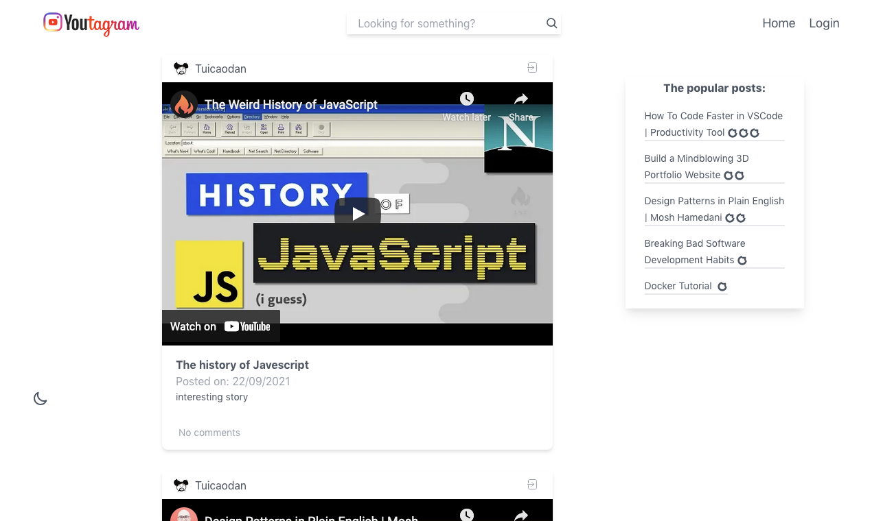
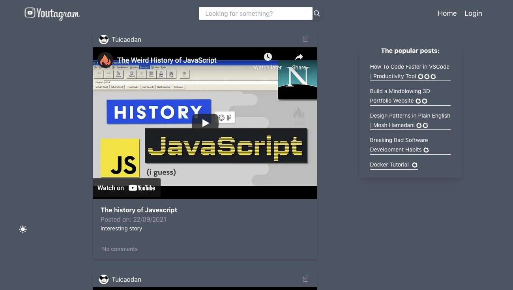
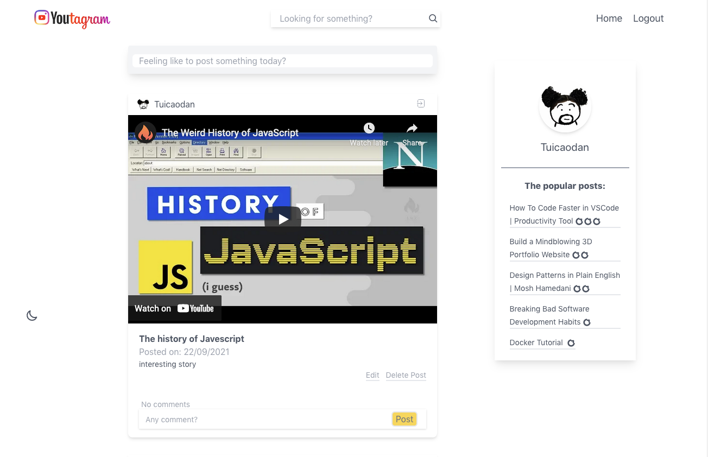
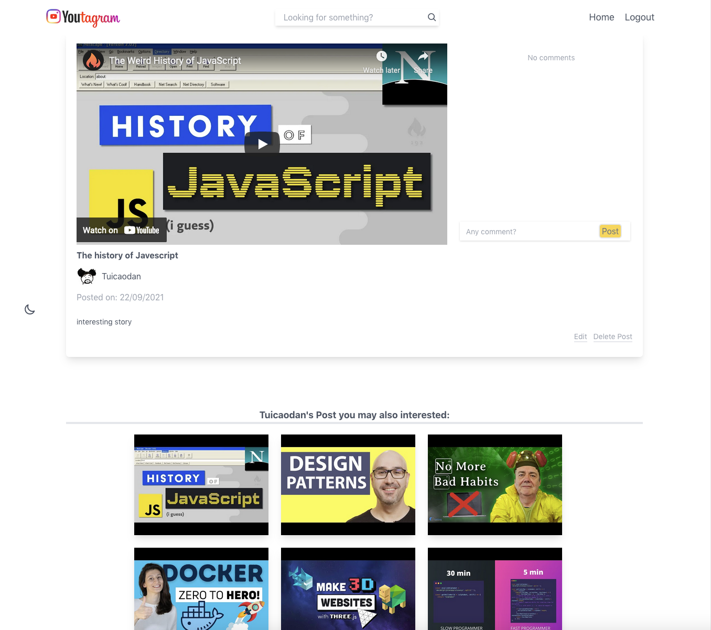
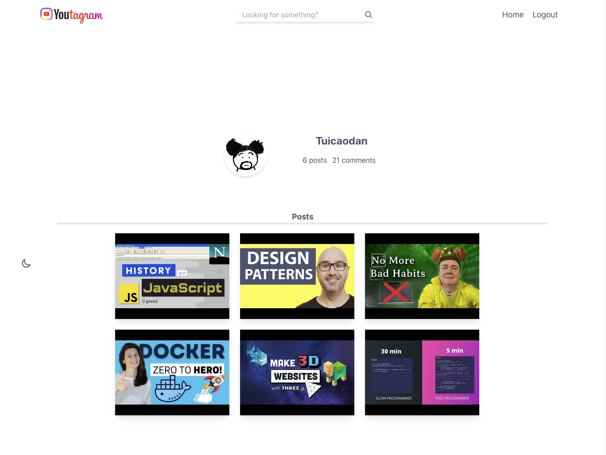
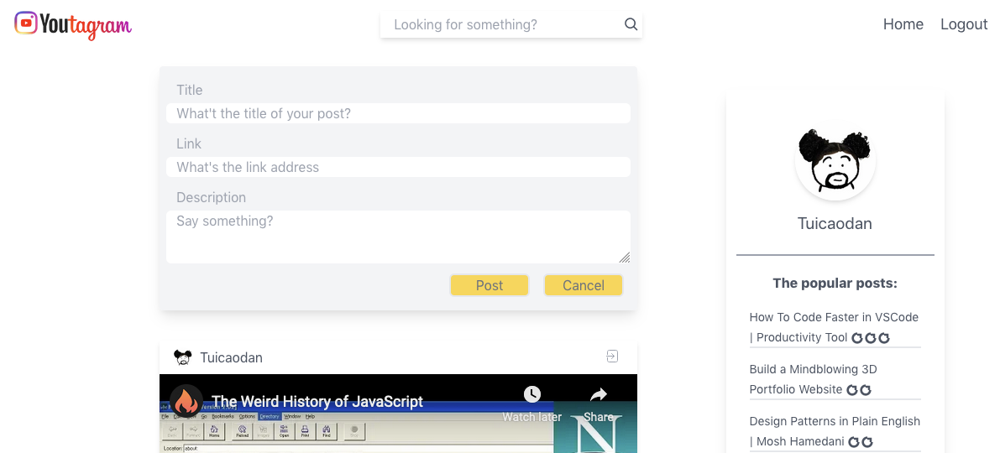
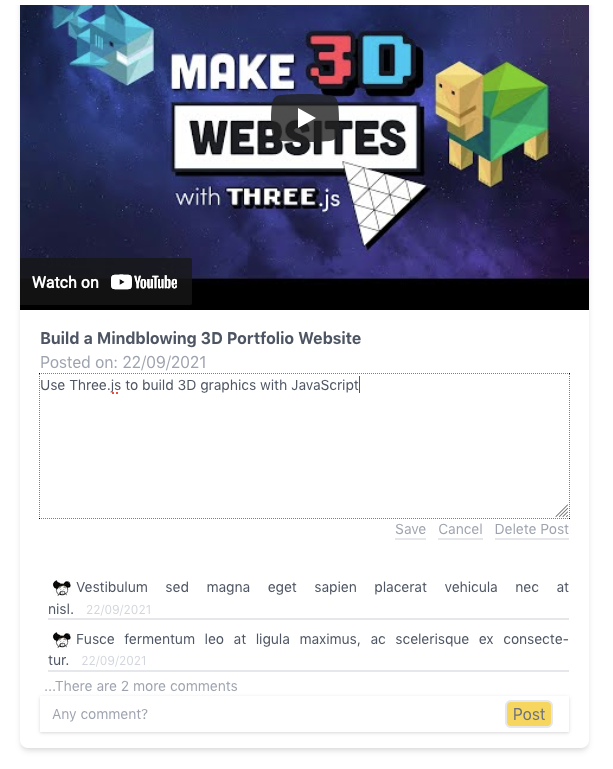

# Youtagram - a Youtube version of Instagram

> - This is a web app that mock Instagram. Instead of post photos, login users can post Youtube video links. 
> - Users can also read and comment on posts. The author of the post is allowed to update or delete the post.
> - You can find a live demo [_here_](https://youtagram.azurewebsites.net).

## Table of Contents

- [General Info](#general-information)
- [Screenshots](#screenshots)
- [Technologies Used](#technologies-used)
- [Features](#features)
- [Setup](#setup)


## General Information

- The aim of this project is to learn React, TypeSript, Apollo Client for GraphQL, Styled Components, TailwindCSS, OAuth and React Context API.


## Screenshots
- Home Page: <br />
  

- Home Page, dark theme: <br />
  

- Home Page, login view: <br />
  

- Single Post Page: <br />
  

- User Page: <br />
  

- Post Submission: <br />
  

- Post Editing: <br />
  


## Technologies Used

- react: 17.0.2
- typescript: 4.1.5
- twin.macro: 2.6.2
- react-router-dom: 5.2.0
- react-burger-menu: 3.0.6
- graphql: 15.5.1
- react-router-dom: 5.2.0
- react-burger-menu: 3.0.6
- graphql: 8.5.1
- craco/craco: 6.2.0
- apollo/client: 3.4.7


## Features

- React + TypeScript web app
- Use Apollo Client to connect to a GraphQL API endpoint
- Use Styled Components + TailwinCSS to simplify the styling
- Responsive UI with react burger menu
- Use OAuth for authentication
- Use React Router to handle navigations
- Dark mode toggle
- Search function
- Use lightweight React Context API to manage state(auth content/theme content/posts content/search content)
- Skeletons views when loading


## Setup

To run this project, install it locally using npm

```bash
$ npm install
$ npm run start
```

You need to provide your own .env file, which should include:
> REACT_APP_GITHUB_APP_ID=your own GITHUB_APP_ID
> REACT_APP_GITHUB_CLIENT_ID=your own GITHUB_CLIENT_ID
> REACT_APP_GITHUB_CLIENT_SECRET=your own GITHUB_CLIENT_SECRET
> REACT_APP_REDIRECT_URI=your own REACT_APP_REDIRECT_URI

You can use run the project locally:
http://localhost:3000/
